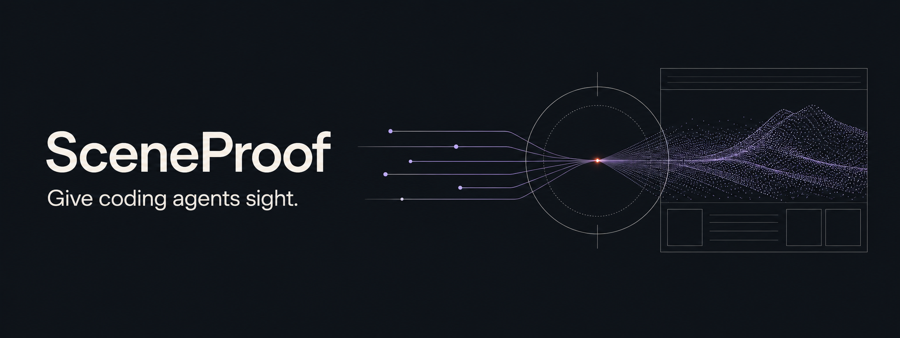

<p align="center">
  
</p>

<p align="center">
  <strong>Coding agents can read your source. They can't see it render.</strong><br />
  SceneProof closes that gap: it rebuilds your real UI or Three.js scene,
  renders it at full quality, and hands the agent evidence instead of a guess.
</p>

<p align="center">
  <a href="https://github.com/ReyJ94/SceneProof/releases/tag/v0.6.0"></a>
  <a href="LICENSE"></a>
</p>

An agent can write a component, run the build, and still have no idea whether
the result is legible, well-lit, or on screen at all. A screenshot doesn't
help much either — it throws away hierarchy and geometry, and blowing it up
never recovers detail that was never rendered. SceneProof gives the agent a
better move: reconstruct the actual source, render it fresh at the quality
the question needs, and inspect the structure behind whatever still looks
wrong — instead of shipping on faith and finding out from a human later.

## Install

```bash
bun add --global github:ReyJ94/SceneProof
sceneproof --help
```

Needs [Bun](https://bun.com/docs/installation) 1.3.14+ and a local Chrome or
Chromium. If something doesn't come up clean, check
[troubleshooting](#troubleshooting).

## Try it

```bash
sceneproof render src/components/DemoCard.tsx \
  dom:demo-card \
  --export DemoCard \
  --props fixtures/demo-card.json \
  --scale 4 \
  --out artifacts/demo-card.png
```

Swap in your own component and props file. That command reconstructs it from
source and renders it at full quality — not a crop, not a browser screenshot.
From here, [`tree`](#agent-facing-surface) browses structure,
[`scout`](#threejs-quick-path) finds a good Three.js camera on its own, and
the [React](#react-quick-path) / [Three.js](#threejs-quick-path) sections
below cover the rest.

## What it gives an agent

- **A real structure to reason from** — React and Three.js trees with stable
  IDs, bounds, styles, materials, lights, and cameras, not just pixels.
- **The right view, not just more pixels** — context renders, close-up
  regions, and Scout-picked cameras, so detail only gets denser once the
  framing already shows what matters.
- **An honest verdict, not a false positive** — every result separates
  whether the command *ran* from whether the result is actually *judgeable*.
  A successful command is not the same as a correct design.
- **Real reference comparison** — aligned silhouette, luminance, and pixel-probe
  deltas against a supplied image, with an auditable mask so a comparison
  can't quietly grade against the wrong subject.
- **Explicit WebGL/WebGPU provenance** — every render reports the backend and
  adapter it actually used, and a requested WebGPU path fails loudly instead
  of silently falling back to WebGL.

## What's new in v0.6.0

Evidence cameras now convert explicitly between perspective and orthographic
projection, seed-assisted reference masks can be audited before you trust
their metrics, silhouette disagreement is localized over 101 height samples,
and every supplied reference view stays visible in one non-substituting
comparison sheet.

<details>
<summary>Earlier releases</summary>

**v0.5.0** — render Three.js fixtures through explicit WebGL or WebGPU
backends, prove the actual backend and adapter in every report, and reject
silent WebGL fallback or incompatible GLSL-only material paths.

**v0.4.0** — distinguish execution from visual acceptance, derive typed React
prop fixtures, compare targets in context and isolation, assert delivery
scale, and expose amplified motion and fitted-silhouette evidence.

**v0.3.0** — compare renders with supplied references, measure silhouette and
luminance deltas, probe exact subject-relative pixels, bracket fixture
parameters in one sweep, and constrain 3D work from labeled reference views.

</details>

## Agent-facing surface

| Verb | Purpose |
| --- | --- |
| `tree` | Navigate semantic structure |
| `node` | Inspect one exact target and its immediate relationships |
| `props` | Derive a typed JSON skeleton for a React component export |
| `inspect` | Reconstruct the source and preserve the canonical scene artifact |
| `scout` | Discover useful Three.js target cameras in one scene lifecycle |
| `render` | Produce fresh context or target evidence |
| `render-region` | Rerender an exact logical viewport patch |
| `doctor` | Prove Chromium and WebGL/WebGPU readiness and explain required permissions |

SceneProof owns renderer setup and evidence persistence. The agent chooses the
real source boundary, declared state, semantic target, framing, and evidence
needed to resolve the uncertainty.

## React quick path

Point any of the verbs at a named export with deterministic JSON props —
SceneProof also picks up source CSS, workspace `@/` aliases, and Tailwind v4:

```bash
sceneproof tree src/components/DemoCard.tsx --export DemoCard --props fixtures/demo-card.json
sceneproof node src/components/DemoCard.tsx dom:demo-card --export DemoCard --props fixtures/demo-card.json
sceneproof render src/components/DemoCard.tsx dom:demo-card --export DemoCard --props fixtures/demo-card.json --scale 4 --out artifacts/demo-card.png
```

Don't have a fixture yet for a typed production component? Derive one instead
of reverse-engineering the prop type by hand:

```bash
sceneproof props src/PricingPanel.tsx --export PricingPanel --out fixtures/pricing-panel.json
```

`--partial-props` deep-completes a partial object with clearly labeled
placeholders, and the report lists exactly which paths are synthesized so
none get mistaken for real state. `render-region` renders a fresh viewport
patch at device scale rather than cropping an existing image.

## Three.js quick path

Any export name works — `--renderer auto` detects Three.js from its
`{ scene, camera }` return contract, or brand a factory explicitly with
`defineThreeFixture` from `sceneproof/three`. Inspect structure first, then
let Scout find a useful camera when you're not sure which one you need:

```bash
sceneproof node scene.ts three:featured-item --export createGalleryEvidence --props fixtures/selected.json
sceneproof scout scene.ts three:featured-item --export createGalleryEvidence --props fixtures/selected.json --out artifacts/gallery-scout
```

Scout returns four kinds of view — `context` (literal source composition),
`sourceDetail` (a fresh region render), `detail` (close, ranked for target
visibility), and `shape` (an alternate angle ranked for form). Only reach for
`--scale` once framing is right and raster detail is still the limit.

`--projection perspective|orthographic` converts the evidence camera when a
supplied reference needs to match it — `fit` contains the target, `fill`
allows controlled clipping for close inspection. Actions and timeline frames
stay inside one real scene lifecycle:

```bash
sceneproof render scene.ts three:featured-item --export createGalleryEvidence --props fixtures/selected.json \
  --action select --frames before,0,80,160,settled --framing source --out artifacts/select-transition.png
```

`--context-pair` captures a target in and out of its surrounding scene in the
same lifecycle, so a form never gets approved against an empty background it
won't ship with. For the full lifecycle, instance-ID, and diagnostic
contracts, see [the Three.js fixture protocol](docs/three-fixtures.md).

WebGL is the default. Request WebGPU explicitly with `--three-backend webgpu`
when the source supports it — SceneProof reports the actual backend and
adapter used, and fails the command rather than silently falling back to
WebGL2 if the source isn't compatible. Full backend and compatibility details
live under [Execution diagnostics](docs/three-fixtures.md#execution-diagnostics)
in the fixture protocol.

## How SceneProof judges a result

Every result carries three separate answers, because a command that *ran*
isn't the same as a design that's *right*:

- **Execution** — did the command finish and persist its artifacts.
- **Evidence** — can the artifact actually support the claim being checked:
  `judgeable`, `partially-judgeable`, `unjudgeable`, or `not-requested`.
- **Assessment** — who owns the verdict. Delivery-scale or motion checks can
  pass or fail automatically; matching a supplied reference stays an
  agent-owned judgment SceneProof won't make for you.

```json
{
  "success": true,
  "execution": { "status": "succeeded", "meaning": "command-execution-only" },
  "evidence": { "status": "judgeable" },
  "assessment": { "decisionOwner": "agent", "verdict": "review-required" }
}
```

Reference comparisons (`--reference`) go further: an aligned silhouette
overlay, amplified difference map, and candidate mask, plus paired luminance
histograms and repeatable `--probe x,y` samples. The agent has to confirm the
overlay is actually on the intended subject before trusting any of it — an
inadequate mask or dynamic range comes back `unjudgeable` rather than a false
match. `--sweep-objective geometry|appearance|composition|balanced` picks
which of those facts ranks a one-variable `--sweep`. Multiple labeled views
can be declared at once via `--reference-set`, each scored on its own camera
and mask, with the aggregate never substituting one perspective for another.

## Inspecting application source

Prefer an existing product export whenever it's already the real visual
boundary. When deterministic setup is genuinely needed, keep it separate from
application code: reusable inspectors go in `scripts/sceneproof/<surface>.scene.ts`,
their fixtures in `scripts/sceneproof/fixtures/`, one-off investigations under
`/tmp/sceneproof-inspectors/` — never adapters, copied geometry, or invented
state inside `src`. An inspector may import the production owner unchanged
and drive it with real props and actions, but it can't guess how the app
"probably" looks: it proves the current code under a declared fixture state,
not parity with an unrecorded live session. If the real boundary can't be
loaded without fabricating the behavior under test, SceneProof blocks the
verification rather than approximating it.

## Current scope

Supported today: TypeScript/JavaScript entries; React DOM with computed
styles, semantic roles, SVG subtrees, and region rendering; workspace `@/`
imports, JSON props, source CSS, and Tailwind v4; full Three.js scene graphs
— transforms, bounds, geometry attributes, materials, uniforms, textures,
lights, cameras; explicit WebGL/WebGPU capture with strict compatibility
checks; custom-named factories, deterministic props/actions/time, and stable
`InstancedMesh` IDs; reference/current/difference comparison with silhouette,
luminance, and mask-audit evidence; typed React prop skeletons with
provenance-marked partial completion.

Not yet: SVG-native export. The GitHub install uses SceneProof's linked
source entry — the standalone compiled binary is still experimental for
arbitrary workspace entries with nested imports. WebGPU support is bounded by
the source's own Three.js compatibility; SceneProof doesn't translate GLSL
shaders or WebGL-only addons into TSL for you.

## Troubleshooting

<details>
<summary><strong>I do not have Bun yet</strong></summary>

On macOS or Linux:

```bash
curl -fsSL https://bun.com/install | bash
```

On Windows PowerShell:

```powershell
powershell -c "irm bun.sh/install.ps1|iex"
```

Open a new terminal, confirm `bun --version`, then run the SceneProof install
command above.

</details>

<details>
<summary><strong><code>sceneproof: command not found</code></strong></summary>

Bun places global commands in `~/.bun/bin`. If that's not already on your
PATH, add these lines to `~/.zshrc` or `~/.bashrc`, then open a new terminal:

```bash
export BUN_INSTALL="$HOME/.bun"
export PATH="$BUN_INSTALL/bin:$PATH"
```

</details>

<details>
<summary><strong>Chrome is not detected</strong></summary>

```bash
export SCENEPROOF_CHROME_PATH="/path/to/chrome"
sceneproof doctor
```

</details>

<details>
<summary><strong>Chromium is blocked by an agent sandbox</strong></summary>

Run `sceneproof` directly with the agent's **unsandboxed/local-render
permission** — don't wrap it in a compound shell or pipe, which can stop
Chromium from starting before SceneProof can even report the failure.

```bash
sceneproof doctor
```

`doctor` checks executable discovery, browser launch, WebGL availability, a
real WebGPU clear-and-readback probe, and the active renderer/adapter, and
exits non-zero if a requirement isn't met. Use
`sceneproof doctor --require-backend both` when both backends are required.

</details>

## Development

<details>
<summary><strong>Work from source</strong></summary>

```bash
git clone https://github.com/ReyJ94/SceneProof.git
cd SceneProof
bun install --frozen-lockfile
bun run cli --help
```

</details>

<details>
<summary><strong>Local quality gate</strong></summary>

```bash
bun run check
```

Runs lint, strict TypeScript 7 typechecking, the browser-backed test harness,
the Bun compiled build, and a compiled typed-props smoke test.

</details>

See [the changelog](CHANGELOG.md) for release-level behavior changes.

## License

[MIT](LICENSE) © 2026 ReyJ94
